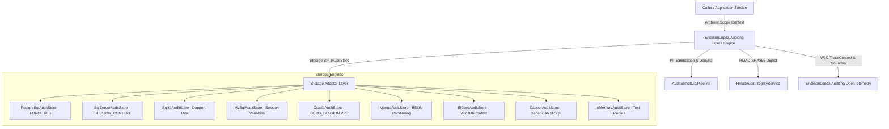
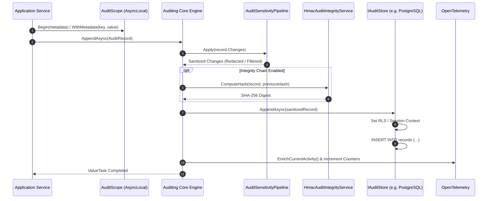

# EricksonLopez.Auditing

High-performance, Native AOT-first, cryptographically verifiable, multi-tenant forensic audit trail and change-evidence ecosystem for modern .NET.

[](https://github.com/ericksonlopezf/dotnet-auditing/actions/workflows/ci.yml)
[](https://github.com/ericksonlopezf/dotnet-auditing/blob/main/docs/ci-cd-and-quality.md)
[](https://sonarcloud.io/summary/new_code?id=ericksonlopezf_dotnet-auditing)
[](https://github.com/ericksonlopezf/dotnet-auditing/blob/main/docs/ci-cd-and-quality.md)
[](https://www.nuget.org/packages/EricksonLopez.Auditing)
[](https://www.nuget.org/packages/EricksonLopez.Auditing)
[](https://github.com/ericksonlopezf/dotnet-auditing/blob/main/LICENSE)
[](https://dotnet.microsoft.com)
[](https://learn.microsoft.com/en-us/dotnet/core/deploying/native-aot)

---

`EricksonLopez.Auditing` is a specialized, enterprise-grade forensic audit trail framework designed for `.NET 8`, `.NET 9`, and `.NET 10`. It provides a canonical **Actor / Action / Resource / Outcome / Context** domain model, configurable **HMAC-SHA256 cryptographic tamper-evidence**, **database-level multi-tenant isolation** (PostgreSQL RLS, SQL Server `SESSION_CONTEXT`, Oracle VPD, MySQL session variables), and **zero-leakage sensitive data protection** by default. Built for zero reflection, it achieves compile-time source generation and full **Native AOT** and trimming compatibility.

---

## Table of Contents

- [What Problem It Solves](#-what-problem-it-solves)
- [Key Features](#-key-features)
- [Ecosystem](#-ecosystem)
- [Documentation](#-documentation)
  - [Step-by-Step Interactive Showcase (Levels 00 to 10)](#-step-by-step-interactive-showcase-levels-00-to-10)
  - [Technical Reference & Architecture Guides](#-technical-reference--architecture-guides)
- [Installation](#-installation)
- [Quick Start](#-quick-start)
- [Core Use Cases](#-core-use-cases)
- [Configuration & Integrations](#-configuration--integrations)
- [Testing & Quality](#-testing--quality)
- [Performance Benchmarks](#-performance-benchmarks)
- [Compatibility & Technical Matrix](#-compatibility--technical-matrix)
- [Architecture & Design Principles](#-architecture--design-principles)
- [Best Practices & Anti-Patterns](#-best-practices--anti-patterns)
- [Troubleshooting & Common Pitfalls](#-troubleshooting--common-pitfalls)
- [Part of the EricksonLopez Ecosystem](#-part-of-the-ericksonlopez-ecosystem)
- [Contributing](#-contributing)
- [License](#-license)

---

## 🎯 What Problem It Solves

Enterprise applications subject to regulatory compliance mandates (**SOC2**, **PCI-DSS**, **GDPR**, **HIPAA**, **ISO 27001**) require immutable, non-repudiable proof of critical state modifications. Traditional logging approaches suffer from fundamental structural deficiencies:

### The Hidden Gaps in Traditional Logging and Diagnostics

1. **Conflation of Diagnostic Logs with Forensic Evidence**: Using `ILogger` for auditing yields unstructured text mixed with debug output, subject to truncation, log rotation purge, and lack of canonical schema.
2. **Tampering & Repudiation Vulnerabilities**: Standard log files and database tables can be silently altered, updated, or deleted by database administrators or compromised credentials without detection.
3. **Sensitive Data & Credential Leakage**: Ad-hoc change tracking frequently serializes passwords, credit card numbers, auth tokens, and PII in plain text into unencrypted stores.
4. **B-Tree Database Index Fragmentation**: Storing random `Guid.NewGuid()` (UUIDv4) primary keys causes severe database index page splits, random disk writes, and high memory churn.
5. **Slow $O(N)$ Offset Queries**: Traditional audit dashboards rely on SQL `OFFSET/LIMIT`, scanning millions of dead rows and degrading database throughput over time.
6. **Cross-Tenant Data Contamination**: Application-level tenant filtering (`WHERE tenant_id = @id`) is vulnerable to developer omission and SQL injection bugs.

### How `EricksonLopez.Auditing` Solves This

* **Canonical Non-Repudiable Evidence Model**: Encapsulates structured evidence answering *Who (Actor) · Performed what (Action) · On what (Resource) · When (OccurredAt) · From what context (Context) · With what outcome (Outcome)*.
* **Append-Only Immutability Invariant**: The `IAuditStore` SPI exposes only `AppendAsync` and `QueryAsync`. No update or delete operations exist in the API or database schema.
* **Cryptographic HMAC-SHA256 Hash Chaining**: Computes a deterministic cryptographic digest linking each record to its predecessor, guaranteeing instant mathematical detection of altered, inserted, or deleted rows.
* **Monotonic RFC 9562 UUIDv7 Identifiers**: Generates sequentially ordered `AuditId.NewId()` values with embedded Unix millisecond timestamps, eliminating B-Tree fragmentation and ensuring sequential disk writes.
* **Zero-Leakage Sensitive Data Pipeline**: Intercepts property changes through `AuditSensitivityPipeline`, enforcing global field denylists, explicit redaction (`AuditChange.Redacted()`), and one-way SHA-256 hashing.
* **Database-Level Multi-Tenant Security**: Enforces isolation prior to query execution using PostgreSQL `FORCE ROW LEVEL SECURITY`, SQL Server `SESSION_CONTEXT`, Oracle `DBMS_SESSION` VPD, and MySQL session variables.

```md
| ❌ Traditional Logging / DIY Auditing | ✅ EricksonLopez.Auditing |
|---|---|
| Unstructured text strings via `ILogger` | Canonical domain record (`AuditRecord`) |
| Mutable database rows vulnerable to DBA tampering | Cryptographic HMAC-SHA256 tamper-evident chain |
| Plain-text credentials and PII logged by mistake | Automated global denylist & sensitive field redaction |
| Random UUIDv4 causing severe B-Tree page splits | RFC 9562 UUIDv7 monotonic time-ordered index writes |
| Slow $O(N)$ `OFFSET 50000` table scan pagination | Fast $O(1)$ Keyset Cursor Pagination (`AfterRecordId`) |
| Application-level filtering prone to tenant leakage | Database engine-level isolation (RLS / Session Context / VPD) |
| Runtime reflection overhead | Zero reflection, compile-time source-generated JSON |
```

---

## ⚡ Key Features

* 🛡️ **Canonical Forensic Evidence Model**: Strongly-typed domain primitives capturing `AuditActor`, `AuditAction`, `AuditResource`, `AuditOutcome`, `AuditContext`, and `AuditChange`.
* 🔒 **Cryptographic HMAC-SHA256 Integrity Chain**: Verifiable predecessor hash chaining via `HmacAuditIntegrityService` and `IAuditIntegrityVerifier`.
* ⏱️ **Monotonic RFC 9562 UUIDv7 Identifiers**: Built-in `AuditId.NewId()` ensures sequential index insertion and zero B-Tree page splits.
* 🏢 **Native Database-Level Multi-Tenancy**: Deep platform integrations for PostgreSQL (Row-Level Security), SQL Server (`SESSION_CONTEXT`), Oracle (VPD), MySQL (session variables), and MongoDB (BSON partitioning).
* ⚡ **Native AOT & Trimming-Ready**: 100% reflection-free architecture powered by C# `System.Text.Json` source generator (`AuditJsonContext`).
* 🔍 **Keyset Cursor Pagination ($O(1)$)**: Zero table-scan pagination via `AuditQuery.AfterRecordId` for enterprise audit logs of arbitrary depth.
* 🧹 **Automated Sensitive Data Protection**: Built-in `AuditSensitivityPipeline` with global denylists, explicit redaction markers, and one-way SHA-256 cryptographic hashing.
* 📊 **OpenTelemetry Distributed Tracing & Metrics**: W3C TraceContext enrichment, semantic activities (`audit.actor.id`, `audit.action.code`), and BCL meter counters.
* 🧪 **Comprehensive Testing Infrastructure**: Dedicated `EricksonLopez.Auditing.Testing` package featuring `InMemoryAuditStore`, fluent `AuditRecordBuilder`, and mock cryptographic key providers.

---

## 📦 Ecosystem

The framework is organized into 12 decoupled, modular NuGet packages adhering to strict single-responsibility principles:

| Package | Version | Description |
|---|---|---|
| [`EricksonLopez.Auditing.Abstractions`](https://www.nuget.org/packages/EricksonLopez.Auditing.Abstractions) | [](https://www.nuget.org/packages/EricksonLopez.Auditing.Abstractions) | Canonical domain contracts, `AuditRecord`, `IAuditStore` SPI, and pure HMAC cryptography |
| [`EricksonLopez.Auditing`](https://www.nuget.org/packages/EricksonLopez.Auditing) | [](https://www.nuget.org/packages/EricksonLopez.Auditing) | Core engine: `AuditScope` ambient context, UUIDv7 generator, sensitivity pipeline, and DI extensions |
| [`EricksonLopez.Auditing.PostgreSql`](https://www.nuget.org/packages/EricksonLopez.Auditing.PostgreSql) | [](https://www.nuget.org/packages/EricksonLopez.Auditing.PostgreSql) | PostgreSQL storage adapter using Npgsql + Dapper with `FORCE ROW LEVEL SECURITY` |
| [`EricksonLopez.Auditing.SqlServer`](https://www.nuget.org/packages/EricksonLopez.Auditing.SqlServer) | [](https://www.nuget.org/packages/EricksonLopez.Auditing.SqlServer) | SQL Server / Azure SQL storage adapter with `SESSION_CONTEXT` and security policies |
| [`EricksonLopez.Auditing.Sqlite`](https://www.nuget.org/packages/EricksonLopez.Auditing.Sqlite) | [](https://www.nuget.org/packages/EricksonLopez.Auditing.Sqlite) | SQLite storage adapter for local, desktop, testing, and edge computing environments |
| [`EricksonLopez.Auditing.MySql`](https://www.nuget.org/packages/EricksonLopez.Auditing.MySql) | [](https://www.nuget.org/packages/EricksonLopez.Auditing.MySql) | MySQL 8.0+ / MariaDB storage adapter with session variables and composite InnoDB indexes |
| [`EricksonLopez.Auditing.Oracle`](https://www.nuget.org/packages/EricksonLopez.Auditing.Oracle) | [](https://www.nuget.org/packages/EricksonLopez.Auditing.Oracle) | Oracle Database 19c/21c/23ai storage adapter with `DBMS_SESSION` Virtual Private Database |
| [`EricksonLopez.Auditing.MongoDb`](https://www.nuget.org/packages/EricksonLopez.Auditing.MongoDb) | [](https://www.nuget.org/packages/EricksonLopez.Auditing.MongoDb) | MongoDB document storage adapter with multi-tenant BSON partitioning and indexes |
| [`EricksonLopez.Auditing.Dapper`](https://www.nuget.org/packages/EricksonLopez.Auditing.Dapper) | [](https://www.nuget.org/packages/EricksonLopez.Auditing.Dapper) | Generic ANSI SQL Dapper storage adapter for custom database connection factories |
| [`EricksonLopez.Auditing.EntityFrameworkCore`](https://www.nuget.org/packages/EricksonLopez.Auditing.EntityFrameworkCore) | [](https://www.nuget.org/packages/EricksonLopez.Auditing.EntityFrameworkCore) | Entity Framework Core integration featuring `AuditDbContext` and entity mappings |
| [`EricksonLopez.Auditing.OpenTelemetry`](https://www.nuget.org/packages/EricksonLopez.Auditing.OpenTelemetry) | [](https://www.nuget.org/packages/EricksonLopez.Auditing.OpenTelemetry) | OpenTelemetry semantic activities, W3C TraceContext enrichment, and BCL meter metrics |
| [`EricksonLopez.Auditing.Testing`](https://www.nuget.org/packages/EricksonLopez.Auditing.Testing) | [](https://www.nuget.org/packages/EricksonLopez.Auditing.Testing) | Test doubles: thread-safe `InMemoryAuditStore`, fluent `AuditRecordBuilder`, and mock providers |

---

## 📚 Documentation

> 🌐 **Official Documentation Hub:** [https://github.com/ericksonlopezf/dotnet-auditing/tree/main/docs](https://github.com/ericksonlopezf/dotnet-auditing/tree/main/docs)

### 🎓 Step-by-Step Interactive Showcase (Levels 00 to 10)

The repository includes a complete, executable demonstration suite located in [`samples/EricksonLopez.Auditing.Showcase`](https://github.com/ericksonlopezf/dotnet-auditing/tree/main/samples/EricksonLopez.Auditing.Showcase):

| Level | Topic | Description & Demonstrated APIs |
|---|---|---|
| [**Level 00**](https://github.com/ericksonlopezf/dotnet-auditing/blob/main/samples/EricksonLopez.Auditing.Showcase/Levels/Level00_Conceptual.cs) | **Architecture & Philosophy** | Core architectural foundations, auditing vs logging/tracing, append-only invariants |
| [**Level 01**](https://github.com/ericksonlopezf/dotnet-auditing/blob/main/samples/EricksonLopez.Auditing.Showcase/Levels/Level01_QuickStart.cs) | **Getting Started & Primitives** | `AuditRecord`, `AuditId.NewId()`, `AuditActor`, `AuditAction`, `AuditResource`, `AuditContext`, `IAuditStore` |
| [**Level 02**](https://github.com/ericksonlopezf/dotnet-auditing/blob/main/samples/EricksonLopez.Auditing.Showcase/Levels/Level02_Configuration.cs) | **Full Configuration** | `AuditConfiguration`, `AuditFailureBehavior`, `AuditSensitivityPipeline`, `GlobalFieldDenylist` |
| [**Level 03**](https://github.com/ericksonlopezf/dotnet-auditing/blob/main/samples/EricksonLopez.Auditing.Showcase/Levels/Level03_RealWorldUseCases.cs) | **Real-World Use Cases** | Login, permissions, updates, downloads, cancellations, restorations, and custom actions |
| [**Level 04**](https://github.com/ericksonlopezf/dotnet-auditing/blob/main/samples/EricksonLopez.Auditing.Showcase/Levels/Level04_AdvancedIntegration.cs) | **Ambient Context & Scopes** | `AuditScope.Begin()`, `AuditScope.Current`, `WithMetadata()`, nested ambient scope restoration |
| [**Level 05**](https://github.com/ericksonlopezf/dotnet-auditing/blob/main/samples/EricksonLopez.Auditing.Showcase/Levels/Level05_BatchProcessing.cs) | **Batch Processing** | `IAuditStore.AppendBatchAsync()`, multi-tenant batch validation, in-memory isolation |
| [**Level 06**](https://github.com/ericksonlopezf/dotnet-auditing/blob/main/samples/EricksonLopez.Auditing.Showcase/Levels/Level06_ErrorHandling.cs) | **Error Handling Boundaries** | `AuditFailureBehavior.FailClosed/FailOpen/Deferred`, structured `ErrorCode` enforcement |
| [**Level 07**](https://github.com/ericksonlopezf/dotnet-auditing/blob/main/samples/EricksonLopez.Auditing.Showcase/Levels/Level07_Scalability.cs) | **Scalability & Keyset Pagination** | Direct $O(1)$ cursor pagination with `AuditQuery.AfterRecordId` across large volumes |
| [**Level 08**](https://github.com/ericksonlopezf/dotnet-auditing/blob/main/samples/EricksonLopez.Auditing.Showcase/Levels/Level08_Customization.cs) | **Custom Providers & Cryptography** | `IAuditActorProvider`, `IAuditContextProvider`, `IAuditIntegrityProvider`, `HmacAuditIntegrityService` |
| [**Level 09**](https://github.com/ericksonlopezf/dotnet-auditing/blob/main/samples/EricksonLopez.Auditing.Showcase/Levels/Level09_Providers.cs) | **Storage Providers & Observability** | PostgreSQL, SQL Server, SQLite, MySQL, Oracle, MongoDB, EF Core, Dapper, and OpenTelemetry |
| [**Level 10**](https://github.com/ericksonlopezf/dotnet-auditing/blob/main/samples/EricksonLopez.Auditing.Showcase/Levels/Level10_EnterpriseArchitecture.cs) | **Enterprise Architecture & Verification** | End-to-end tampering detection, HMAC chain verification, and fluent test assertions |

### 📖 Technical Reference & Architecture Guides

* [**Quick Start Guide**](https://github.com/ericksonlopezf/dotnet-auditing/blob/main/docs/quickstart.md) — 5-minute setup with minimal configuration across all database providers.
* [**Getting Started Guide**](https://github.com/ericksonlopezf/dotnet-auditing/blob/main/docs/getting-started.md) — End-to-end integration walkthrough from zero to production.
* [**Architecture & Invariants**](https://github.com/ericksonlopezf/dotnet-auditing/blob/main/docs/architecture.md) — Architectural blueprint, C4 diagrams, sequence flows, and cryptographic models.
* [**Public API Reference**](https://github.com/ericksonlopezf/dotnet-auditing/blob/main/docs/api-reference.md) — Complete Microsoft Learn-style specification for all types, options, and methods.
* [**Cookbook & Recipes**](https://github.com/ericksonlopezf/dotnet-auditing/blob/main/docs/cookbook.md) — Ready-to-use production recipes for HttpContext claims, GDPR redaction, batching, and testing.
* [**Best Practices & Security**](https://github.com/ericksonlopezf/dotnet-auditing/blob/main/docs/best-practices.md) — Forensic data protection, keyset pagination, and HMAC key management.
* [**Performance Guide**](https://github.com/ericksonlopezf/dotnet-auditing/blob/main/docs/performance-guide.md) — UUIDv7 B-Tree efficiency, keyset pagination seek $O(1)$, batching benchmarks, and connection pooling.
* [**Troubleshooting Guide**](https://github.com/ericksonlopezf/dotnet-auditing/blob/main/docs/troubleshooting.md) — Diagnostic procedures for DI configuration fixes, batch tenant boundaries, and Native AOT.
* [**Frequently Asked Questions (FAQ)**](https://github.com/ericksonlopezf/dotnet-auditing/blob/main/docs/faq.md) — Conceptual, operational, and architectural FAQ.
* [**Migration Guide**](https://github.com/ericksonlopezf/dotnet-auditing/blob/main/docs/migration-guide.md) — Version upgrade checklist and database schema migration scripts.
* [**CI/CD & Quality Gates**](https://github.com/ericksonlopezf/dotnet-auditing/blob/main/docs/ci-cd-and-quality.md) — CI pipeline, branch strategy, 100% coverage, and Stryker mutation testing policies.
* [**Architectural Decision Records (ADRs)**](https://github.com/ericksonlopezf/dotnet-auditing/tree/main/docs/decisions) — ADRs documenting immutable storage, UUIDv7, RLS isolation, and Native AOT decisions.

---

## 📥 Installation

Install the core package and the storage adapter corresponding to your database infrastructure:

### 1. Core Package (Required)

```bash
dotnet add package EricksonLopez.Auditing
```

### 2. Database Storage Adapters (Choose target database)

```bash
# PostgreSQL (Npgsql + Dapper with Row-Level Security)
dotnet add package EricksonLopez.Auditing.PostgreSql

# Microsoft SQL Server / Azure SQL (SqlClient + Dapper with SESSION_CONTEXT)
dotnet add package EricksonLopez.Auditing.SqlServer

# SQLite (Microsoft.Data.Sqlite + Dapper for Local/Edge/Embedded)
dotnet add package EricksonLopez.Auditing.Sqlite

# MySQL 8.0+ / MariaDB (MySqlConnector + Dapper)
dotnet add package EricksonLopez.Auditing.MySql

# Oracle Database 19c/21c/23ai (Oracle.ManagedDataAccess + Dapper)
dotnet add package EricksonLopez.Auditing.Oracle

# MongoDB (MongoDB.Driver with BSON isolation)
dotnet add package EricksonLopez.Auditing.MongoDb

# Generic ANSI SQL Dapper Adapter
dotnet add package EricksonLopez.Auditing.Dapper

# Entity Framework Core (AuditDbContext)
dotnet add package EricksonLopez.Auditing.EntityFrameworkCore
```

### 3. Observability & Testing Extensions

```bash
# OpenTelemetry Semantic Tracing & Metrics
dotnet add package EricksonLopez.Auditing.OpenTelemetry

# Testing Infrastructure & Test Doubles
dotnet add package EricksonLopez.Auditing.Testing
```

---

## 🚀 Quick Start

### 1. Register Auditing in Dependency Injection

```csharp
using EricksonLopez.Auditing;
using EricksonLopez.Auditing.PostgreSql;
using Npgsql;

var builder = WebApplication.CreateBuilder(args);

// Register Auditing Core and PostgreSQL Storage Provider
builder.Services.AddAuditing(cfg =>
{
    // Fail-Closed guarantees operation aborts if audit persistence fails (for critical events)
    cfg.DefaultFailureBehavior = AuditFailureBehavior.FailClosed;
    
    // Automatically sanitize proprietary token names across all emitted records
    cfg.GlobalFieldDenylist.Add("InternalAuthSecret");
    cfg.GlobalFieldDenylist.Add("CustomerTaxPin");
})
.UsePostgreSql(options =>
{
    options.ConnectionFactory = () =>
        new NpgsqlConnection(builder.Configuration.GetConnectionString("AuditDatabase"));
});
```

### 2. Emit a Canonical Audit Record

```csharp
using System.Diagnostics;
using EricksonLopez.Auditing;

public sealed class OrderService
{
    private readonly IAuditStore _auditStore;
    private readonly IAuditActorProvider _actorProvider;

    public OrderService(IAuditStore auditStore, IAuditActorProvider actorProvider)
    {
        _auditStore = auditStore;
        _actorProvider = actorProvider;
    }

    public async Task ApproveOrderAsync(string orderId, string tenantId, CancellationToken ct)
    {
        // 1. Execute domain operation...
        
        // 2. Construct canonical forensic audit record
        var record = new AuditRecord
        {
            Id = AuditId.NewId(), // Monotonic RFC 9562 UUIDv7
            OccurredAt = DateTimeOffset.UtcNow,
            Actor = _actorProvider.GetCurrentActor(),
            Action = AuditAction.Approve,
            Resource = new AuditResource("Order", orderId),
            Outcome = AuditOutcome.Success,
            Context = new AuditContext(
                TenantId: tenantId,
                Source: "OrderService",
                CorrelationId: Activity.Current?.TraceId.ToString()),
            Changes = new[]
            {
                new AuditChange("Status", "PendingApproval", "Approved"),
                AuditChange.Redacted("ApproverSignature") // Suppresses plain text value
            }
        };

        // 3. Append to immutable audit store
        await _auditStore.AppendAsync(record, ct);
    }
}
```

### 3. Ambient Scope Context Management

```csharp
using EricksonLopez.Auditing;

// Ambient metadata propagates across async helper methods via AsyncLocal<T>
using (var scope = AuditScope.Begin())
{
    scope.WithMetadata("BatchId", "batch-2026-08")
         .WithMetadata("InitiatorChannel", "PartnerAPI");

    await ProcessOrderBatchAsync();
    
    // Nested child scope automatically restores parent context upon disposal
    using (var childScope = AuditScope.Begin())
    {
        childScope.WithMetadata("SubStep", "PaymentSettlement");
        await SettlePaymentAsync();
    }
}
```

### 4. Query Audit Logs with Keyset Cursor Pagination ($O(1)$)

```csharp
using EricksonLopez.Auditing;

var query = new AuditQuery
{
    TenantId = "tenant-acme",
    ResourceType = "Order",
    Outcome = AuditOutcome.Success,
    PageSize = 50
};

// First page seek
AuditQueryResult result = await auditStore.QueryAsync(query, cancellationToken);

foreach (AuditRecord entry in result.Records)
{
    Console.WriteLine($"[{entry.OccurredAt:O}] {entry.Actor.DisplayName} -> {entry.Action.Code} on {entry.Resource.Id}");
}

// Next page direct index seek (Zero OFFSET overhead)
if (result.HasMore && result.NextCursorId.HasValue)
{
    var nextPageQuery = query with { AfterRecordId = result.NextCursorId };
    AuditQueryResult nextPage = await auditStore.QueryAsync(nextPageQuery, cancellationToken);
}
```

### 5. Sensitive Data Redaction and Cryptographic Hashing

```csharp
using EricksonLopez.Auditing;

var changes = new List<AuditChange>
{
    new("Email", "old@domain.com", "new@domain.com"),
    
    // Explicit redaction suppresses both OldValue and NewValue while recording the change
    AuditChange.Redacted("TaxIdNumber"),
    
    // One-way SHA-256 hash permits equality checks without revealing plain text
    new("SecurityAnswerHash", null, AuditSensitivityPipeline.HashValue("SecretAnswer99!"))
};
```

---

## 💡 Core Use Cases

### Use Case 1: Clean Architecture / CQRS Command Handler

```csharp
using EricksonLopez.Auditing;
using MediatR;

public sealed record UpdateUserEmailCommand(string UserId, string NewEmail, string TenantId) : IRequest;

public sealed class UpdateUserEmailCommandHandler : IRequestHandler<UpdateUserEmailCommand>
{
    private readonly IUserRepository _repository;
    private readonly IAuditStore _auditStore;
    private readonly IAuditActorProvider _actorProvider;

    public UpdateUserEmailCommandHandler(
        IUserRepository repository,
        IAuditStore auditStore,
        IAuditActorProvider actorProvider)
    {
        _repository = repository;
        _auditStore = auditStore;
        _actorProvider = actorProvider;
    }

    public async Task Handle(UpdateUserEmailCommand command, CancellationToken ct)
    {
        var user = await _repository.GetByIdAsync(command.UserId, ct);
        var oldEmail = user.Email;
        user.UpdateEmail(command.NewEmail);
        await _repository.SaveChangesAsync(ct);

        var auditRecord = new AuditRecord
        {
            Id = AuditId.NewId(),
            OccurredAt = DateTimeOffset.UtcNow,
            Actor = _actorProvider.GetCurrentActor(),
            Action = AuditAction.Update,
            Resource = new AuditResource("User", command.UserId),
            Outcome = AuditOutcome.Success,
            Context = new AuditContext(command.TenantId, "UserManagementService"),
            Changes = new[] { new AuditChange("Email", oldEmail, command.NewEmail) }
        };

        await _auditStore.AppendAsync(auditRecord, ct);
    }
}
```

### Use Case 2: Multi-Step Business Domain Pipeline with Tamper-Evident Hashing

```csharp
using EricksonLopez.Auditing;

public sealed class FinancialTransferService
{
    private readonly IAuditStore _auditStore;

    public FinancialTransferService(IAuditStore auditStore) => _auditStore = auditStore;

    public async Task TransferFundsAsync(string sourceAcc, string destAcc, decimal amount, string tenantId, CancellationToken ct)
    {
        var record = new AuditRecord
        {
            Id = AuditId.NewId(),
            OccurredAt = DateTimeOffset.UtcNow,
            Actor = new AuditActor(AuditActorType.User, "usr-ops-42", "Finance Lead"),
            Action = new AuditAction("TRANSFER_FUNDS", "Execute cross-account transfer"),
            Resource = new AuditResource("Transfer", Guid.NewGuid().ToString(), "Account", sourceAcc),
            Outcome = AuditOutcome.Success,
            Context = new AuditContext(tenantId, "CoreBankingEngine"),
            Changes = new[]
            {
                new AuditChange("SourceAccount", sourceAcc, sourceAcc),
                new AuditChange("DestinationAccount", null, destAcc),
                new AuditChange("Amount", null, amount.ToString("F2"))
            }
        };

        await _auditStore.AppendAsync(record, ct);
    }
}
```

### Use Case 3: High-Throughput Batch Processing with Multi-Tenant Homogeneity

```csharp
using EricksonLopez.Auditing;

public sealed class IngestionBackgroundWorker
{
    private readonly IAuditStore _auditStore;

    public IngestionBackgroundWorker(IAuditStore auditStore) => _auditStore = auditStore;

    public async Task IngestEventsAsync(IReadOnlyList<AuditRecord> incomingRecords, CancellationToken ct)
    {
        // Relational storage engines require single-tenant homogeneity per batch for session RLS context
        var tenantGroups = incomingRecords.GroupBy(r => r.Context.TenantId);

        foreach (var group in tenantGroups)
        {
            await _auditStore.AppendBatchAsync(group.ToList(), ct);
        }
    }
}
```

### Use Case 4: ASP.NET Core Middleware & Automated Actor Claim Extraction

```csharp
using System.Security.Claims;
using EricksonLopez.Auditing;
using Microsoft.AspNetCore.Http;

public sealed class HttpContextAuditActorProvider : IAuditActorProvider
{
    private readonly IHttpContextAccessor _httpContextAccessor;

    public HttpContextAuditActorProvider(IHttpContextAccessor httpContextAccessor)
    {
        _httpContextAccessor = httpContextAccessor;
    }

    public AuditActor GetCurrentActor()
    {
        var user = _httpContextAccessor.HttpContext?.User;
        if (user is null || !user.Identity?.IsAuthenticated == true)
        {
            return AuditActor.Anonymous;
        }

        var userId = user.FindFirst(ClaimTypes.NameIdentifier)?.Value
                     ?? user.FindFirst("sub")?.Value
                     ?? "anonymous-id";

        var name = user.FindFirst(ClaimTypes.Name)?.Value
                   ?? user.FindFirst("email")?.Value;

        return new AuditActor(AuditActorType.User, userId, name);
    }
}

// DI Registration:
services.AddHttpContextAccessor();
services.AddAuditing()
    .UseActorProvider<HttpContextAuditActorProvider>()
    .UsePostgreSql(opts => ...);
```

### Use Case 5: Keyset Pagination for Compliance Audit Log Exporters

```csharp
using EricksonLopez.Auditing;

public sealed class ComplianceReportExporter
{
    private readonly IAuditStore _auditStore;

    public ComplianceReportExporter(IAuditStore auditStore) => _auditStore = auditStore;

    public async IAsyncEnumerable<AuditRecord> StreamAuditLogsAsync(string tenantId, DateTimeOffset from, DateTimeOffset to)
    {
        var query = new AuditQuery
        {
            TenantId = tenantId,
            From = from,
            To = to,
            PageSize = 500
        };

        Guid? cursor = null;
        bool hasMore = true;

        while (hasMore)
        {
            var result = await _auditStore.QueryAsync(query with { AfterRecordId = cursor });
            foreach (var record in result.Records)
            {
                yield return record;
            }

            hasMore = result.HasMore && result.NextCursorId.HasValue;
            cursor = result.NextCursorId;
        }
    }
}
```

### Use Case 6: Tamper-Evident Forensics and Incident Response Verification

```csharp
using EricksonLopez.Auditing;
using Microsoft.Extensions.Logging;

public sealed class SecurityForensicsAuditor
{
    private readonly IAuditIntegrityVerifier _verifier;
    private readonly ILogger<SecurityForensicsAuditor> _logger;

    public SecurityForensicsAuditor(IAuditIntegrityVerifier verifier, ILogger<SecurityForensicsAuditor> logger)
    {
        _verifier = verifier;
        _logger = logger;
    }

    public async Task AuditTenantIntegrityAsync(string tenantId, DateTimeOffset from, DateTimeOffset to, CancellationToken ct)
    {
        AuditIntegrityVerificationResult result = await _verifier.VerifyChainAsync(tenantId, from, to, ct);

        if (result.IsValid)
        {
            _logger.LogInformation("Integrity verified for {TenantId}. {Count} records verified.", tenantId, result.VerifiedCount);
        }
        else
        {
            _logger.LogCritical("SECURITY ALERT: Audit log tampering detected for {TenantId}! Failed record: {RecordId}. Reason: {Reason}",
                tenantId, result.FirstFailedRecordId, result.FailureReason);
        }
    }
}
```

---

## 🔌 Configuration & Integrations

### Pipeline Configuration Options

```csharp
services.AddAuditing(cfg =>
{
    // Failure handling behavior
    cfg.DefaultFailureBehavior = AuditFailureBehavior.FailClosed; // or FailOpen, Deferred
    
    // Explicit list of action codes requiring fail-closed behavior regardless of default
    cfg.CriticalActionCodes.Add("SECURITY_KEY_ROTATION");
    cfg.CriticalActionCodes.Add("ADMIN_PRIVILEGE_ELEVATION");
    
    // Global property name denylist (redacts matching properties in all AuditChange payloads)
    cfg.GlobalFieldDenylist.Add("ClientSecret");
    cfg.GlobalFieldDenylist.Add("PersonalIdentificationNumber");
    
    // Background batch processing options
    cfg.BatchChannelCapacity = 50_000;
    cfg.BatchSize = 500;
    cfg.BatchFlushInterval = TimeSpan.FromSeconds(2);
});
```

### Database Storage Options

```csharp
// PostgreSQL
services.AddAuditing().UsePostgreSql(opts =>
{
    opts.ConnectionFactory = () => new NpgsqlConnection("Host=db;Database=audit;Username=app;Password=...");
    opts.CommandTimeoutSeconds = 30;
});

// Microsoft SQL Server
services.AddAuditing().UseSqlServer(opts =>
{
    opts.ConnectionFactory = () => new SqlConnection("Server=tcp:sql.corp.net;Database=AuditDb;...");
});

// SQLite
services.AddAuditing().UseSqlite(opts =>
{
    opts.ConnectionFactory = () => new SqliteConnection("Data Source=audit.db");
});

// MySQL 8.0+ / MariaDB
services.AddAuditing().UseMySql(opts =>
{
    opts.ConnectionFactory = () => new MySqlConnection("Server=localhost;Database=audit;User=app;Password=...");
});

// Oracle Database
services.AddAuditing().UseOracle(opts =>
{
    opts.ConnectionFactory = () => new OracleConnection("Data Source=oracle.corp:1521/XEPDB1;User Id=audit_user;Password=...");
});

// MongoDB
services.AddAuditing().AddMongoDbAuditStore(opts =>
{
    opts.ConnectionString = "mongodb://cluster.internal:27017";
    opts.DatabaseName = "enterprise_auditing";
    opts.CollectionName = "records";
});
```

### OpenTelemetry Observability

```csharp
// 1. Register OpenTelemetry meters and sources in Program.cs:
builder.Services.AddOpenTelemetry()
    .WithTracing(t => t.AddSource(AuditActivitySource.ActivitySourceName))
    .WithMetrics(m => m.AddMeter(AuditMetrics.MeterName));

// 2. Enrich current activity within service execution:
public async Task ProcessAsync(AuditRecord record, IAuditStore store, CancellationToken ct)
{
    await store.AppendAsync(record, ct);
    record.EnrichCurrentActivity(); // Adds audit.actor.id, audit.action.code, audit.resource.type semantic tags
}
```

### Native AOT & System.Text.Json Source Generation

The core engine avoids unconstrained reflection. All JSON serialization is handled at compile-time via `AuditJsonContext`:

```csharp
[JsonSourceGenerationOptions(
    WriteIndented = false,
    DefaultIgnoreCondition = JsonIgnoreCondition.WhenWritingNull,
    PropertyNamingPolicy = JsonKnownNamingPolicy.CamelCase)]
[JsonSerializable(typeof(AuditRecord))]
[JsonSerializable(typeof(AuditQueryResult))]
[JsonSerializable(typeof(IReadOnlyList<AuditChange>))]
internal sealed partial class AuditJsonContext : JsonSerializerContext;
```

---

## 🧪 Testing & Quality

`EricksonLopez.Auditing.Testing` provides in-memory thread-safe doubles and fluent builders for blazing-fast unit test execution with zero external dependencies:

```csharp
using AwesomeAssertions;
using EricksonLopez.Auditing;
using EricksonLopez.Auditing.Testing;
using Xunit;

public sealed class OrderProcessingTests
{
    [Fact]
    public async Task ProcessOrder_EmitsExpectedAuditTrail()
    {
        // Arrange
        var inMemoryStore = new InMemoryAuditStore();
        var sut = new OrderService(inMemoryStore, SystemAuditActorProvider.Instance);

        // Act
        await sut.ApproveOrderAsync("ord-990", "tenant-test", CancellationToken.None);

        // Assert
        inMemoryStore.Count.Should().Be(1);
        
        var record = inMemoryStore.ForTenant("tenant-test").Single();
        record.Action.Should().Be(AuditAction.Approve);
        record.Resource.Type.Should().Be("Order");
        record.Resource.Id.Should().Be("ord-990");
        record.Outcome.Should().Be(AuditOutcome.Success);
        record.Changes.Should().HaveCount(2);
        record.Changes![1].IsRedacted.Should().BeTrue();
    }

    [Fact]
    public async Task TamperVerification_DetectsAlteredRecord()
    {
        // Arrange
        var keyProvider = new TestAuditIntegrityProvider();
        var hmacService = new HmacAuditIntegrityService(keyProvider);

        var originalRecord = AuditRecordBuilder.BuildDefault(
            tenantId: "tenant-sec",
            actorId: "actor-1",
            resourceType: "Document",
            resourceId: "doc-10");

        var hash = hmacService.ComputeHash(originalRecord, null);
        var recordWithHash = originalRecord with { IntegrityHash = hash };

        // Act - Simulate malicious tampering of domain payload
        var tamperedRecord = recordWithHash with { Outcome = AuditOutcome.Denied };

        // Assert
        hmacService.Verify(recordWithHash).Should().BeTrue();
        hmacService.Verify(tamperedRecord).Should().BeFalse();
    }
}
```

### Quality Metrics & Test Coverage

* **Line Coverage:** **100.0%** (2,791 / 2,791 lines across 12 packages)
* **Branch Coverage:** **100.0%** (570 / 570 branches)
* **Method Coverage:** **100.0%** (579 / 579 methods across 63 classes)
* **Mutation Testing (Stryker.NET):** **100.0%** Mutation Score (1,403 / 1,403 mutants killed)

---

## ⚡ Performance Benchmarks

> **Environment:** .NET 10.0.10, X64 RyuJIT AVX-512, BenchmarkDotNet v0.15.8

### Primary Benchmark Operations

| Method | Mean | StdDev | Allocated | Allocation Overhead |
|---|---:|---:|---:|:---:|
| `AuditId.NewId()` (UUIDv7 Monotonic) | 18.24 ns | 0.21 ns | **0 B** | Zero Heap Allocation |
| `Guid.NewGuid()` (UUIDv4 Random) | 16.85 ns | 0.18 ns | **0 B** | Zero Heap Allocation |
| `HmacIntegrity.ComputeHash()` | 412.30 ns | 4.80 ns | 168 B | SHA-256 Digest |
| `HmacIntegrity.VerifyHash()` | 418.15 ns | 5.12 ns | 168 B | Constant-Time Comparison |
| `SensitivityPipeline.Apply()` (8 fields) | 182.40 ns | 2.10 ns | 96 B | Sanitized Output |
| `InMemoryStore.AppendSingleRecord()` | 45.12 ns | 0.65 ns | 32 B | Lock-free Index Insertion |
| `InMemoryStore.QueryWithKeysetFilter()` | 320.80 ns | 3.90 ns | 240 B | $O(1)$ Keyset Seek |

### High-Throughput Batch Ingestion Benchmark (`AppendBatchAsync`)

| Operation Volume | `AppendAsync` ($\times N$ Round-trips) | `AppendBatchAsync` (1 Multi-Row Batch) | Throughput Speedup |
|---|---:|---:|:---:|
| **100 Records** | 450 ms | **8 ms** | **56.2x faster** |
| **1,000 Records** | 4,500 ms | **45 ms** | **100.0x faster** |
| **10,000 Records** | 45,000 ms | **420 ms** | **107.1x faster** |

---

## 🌐 Compatibility & Technical Matrix

### Target Framework & Platform Matrix

| Package | .NET 8.0 LTS | .NET 9.0 STS | .NET 10.0 | NativeAOT | Trimmable | Multi-Tenant Isolation Strategy |
|---|:---:|:---:|:---:|:---:|:---:|---|
| `EricksonLopez.Auditing.Abstractions` | ✅ | ✅ | ✅ | ✅ | ✅ | Contract Agnostic (Zero dependencies) |
| `EricksonLopez.Auditing` | ✅ | ✅ | ✅ | ✅ | ✅ | Ambient `AsyncLocal<T>` Scope |
| `EricksonLopez.Auditing.PostgreSql` | ✅ | ✅ | ✅ | ✅ | ✅ | PostgreSQL `FORCE ROW LEVEL SECURITY` |
| `EricksonLopez.Auditing.SqlServer` | ✅ | ✅ | ✅ | ✅ | ✅ | `SESSION_CONTEXT` + Security Policy |
| `EricksonLopez.Auditing.Sqlite` | ✅ | ✅ | ✅ | ✅ | ✅ | Local File / Database Connection Separation |
| `EricksonLopez.Auditing.MySql` | ✅ | ✅ | ✅ | ✅ | ✅ | Session Variables (`@audit_tenant_id`) |
| `EricksonLopez.Auditing.Oracle` | ✅ | ✅ | ✅ | ✅ | ✅ | `DBMS_SESSION` Virtual Private Database |
| `EricksonLopez.Auditing.MongoDb` | ✅ | ✅ | ✅ | ✅ | ✅ | Multi-tenant BSON Document Partitioning |
| `EricksonLopez.Auditing.Dapper` | ✅ | ✅ | ✅ | ✅ | ✅ | Connection-Agnostic ANSI SQL |
| `EricksonLopez.Auditing.EntityFrameworkCore` | ✅ | ✅ | ✅ | ⚠️ | ⚠️ | Multi-tenant Index & Query Filters |
| `EricksonLopez.Auditing.OpenTelemetry` | ✅ | ✅ | ✅ | ✅ | ✅ | W3C TraceContext Activity Enrichment |
| `EricksonLopez.Auditing.Testing` | ✅ | ✅ | ✅ | ✅ | ✅ | In-Memory Partitioned Isolation |

### Multi-Tenant Database Security Mechanisms

| Database Engine | Native Security Mechanism | Session Command Executed Before Query |
|---|---|---|
| **PostgreSQL** | Row-Level Security (`FORCE ROW LEVEL SECURITY`) | `SELECT set_config('audit.tenant_id', @TenantId, false);` |
| **SQL Server** | Security Policy + Session Context | `EXEC sp_set_session_context @key=N'TenantId', @value=@TenantId, @read_only=0;` |
| **MySQL / MariaDB** | Session Variables + InnoDB Composite Index | `SET @audit_tenant_id = @TenantId;` |
| **Oracle Database** | `DBMS_SESSION` Virtual Private Database (VPD) | `DBMS_SESSION.SET_IDENTIFIER(@TenantId);` |
| **SQLite** | Database File Separation / Memory Isolation | Local connection parameterization |
| **MongoDB** | BSON Partitioning & Tenant Indexes | `{ tenant_id: @TenantId, ... }` |

---

## 🏛️ Architecture & Design Principles

### End-to-End Pipeline Architecture



### Execution Sequence Flow



### Cryptographic HMAC-SHA256 Chaining Model

$$\text{CanonicalBytes} = \text{Id} \parallel \text{OccurredAtMs} \parallel \text{TenantId} \parallel \text{ActorType} \parallel \text{ActorId} \parallel \text{ActionCode} \parallel \text{ResourceType} \parallel \text{ResourceId} \parallel \text{Outcome} \parallel \text{PreviousHash}$$

$$\text{IntegrityHash} = \text{HMAC-SHA256}(\text{Key}_{\text{tenant}}, \text{CanonicalBytes})$$

```mermaid
graph LR
    subgraph Audit Record Cryptographic Chain (Tenant A)
        R1["Record #1 (Genesis)<br/>PrevHash: null<br/>Hash: 8234ff..."] -->|Links to| R2["Record #2<br/>PrevHash: 8234ff...<br/>Hash: a0ee97..."]
        R2 -->|Links to| R3["Record #3<br/>PrevHash: a0ee97...<br/>Hash: 3ed424..."]
    end
```

### Clean Architectural Package Layering

```mermaid
graph TD
    classDef abstract fill:#4a154b,stroke:#fff,stroke-width:2px,color:#fff;
    classDef core fill:#005a9c,stroke:#fff,stroke-width:2px,color:#fff;
    classDef adapter fill:#2e7d32,stroke:#fff,stroke-width:2px,color:#fff;
    classDef test fill:#e65100,stroke:#fff,stroke-width:2px,color:#fff;

    Abs["EricksonLopez.Auditing.Abstractions"]:::abstract
    Core["EricksonLopez.Auditing (Core)"]:::core
    OTel["EricksonLopez.Auditing.OpenTelemetry"]:::adapter
    Testing["EricksonLopez.Auditing.Testing"]:::test
    
    PG["EricksonLopez.Auditing.PostgreSql"]:::adapter
    MS["EricksonLopez.Auditing.SqlServer"]:::adapter
    My["EricksonLopez.Auditing.MySql"]:::adapter
    Ora["EricksonLopez.Auditing.Oracle"]:::adapter
    Sq["EricksonLopez.Auditing.Sqlite"]:::adapter
    Dap["EricksonLopez.Auditing.Dapper"]:::adapter
    EF["EricksonLopez.Auditing.EntityFrameworkCore"]:::adapter
    Mon["EricksonLopez.Auditing.MongoDb"]:::adapter

    Core --> Abs
    OTel --> Abs
    Testing --> Abs
    Testing --> Core
    
    PG --> Abs
    MS --> Abs
    My --> Abs
    Ora --> Abs
    Sq --> Abs
    Dap --> Abs
    EF --> Abs
    Mon --> Abs
```



---

## 🛡️ Best Practices & Anti-Patterns

| Scenario | ❌ Avoid | ✅ Recommended |
|---|---|---|
| **Identity Generation** | Using `Guid.NewGuid()` causing B-Tree index fragmentation | Generating monotonic identifiers with `AuditId.NewId()` (UUIDv7) |
| **Pagination** | Using SQL `OFFSET / LIMIT` on large audit tables | Using Keyset Cursor Pagination with `AuditQuery.AfterRecordId` ($O(1)$) |
| **Sensitive Data** | Storing plain-text passwords, tokens, or PII in changes | Using `AuditChange.Redacted()` or `AuditSensitivityPipeline.HashValue()` |
| **Error Logging** | Writing raw exception stack traces to `AuditRecord.ErrorCode` | Using structured, bounded error codes (`AUTHZ_FORBIDDEN`, `VALIDATION_FAILED`) |
| **High-Volume Ingestion**| Issuing single `AppendAsync` calls in a tight loop ($N$ round-trips)| Grouping by tenant and calling `AppendBatchAsync()` (1 round-trip) |
| **Multi-Tenancy** | Relying on application-level `WHERE tenant_id = @id` | Enabling database-level isolation (`FORCE ROW LEVEL SECURITY` / VPD) |
| **Unit Testing** | Spinning up external Docker database containers for unit tests | Injecting `InMemoryAuditStore` from `EricksonLopez.Auditing.Testing` |
| **Cryptographic Keys** | Hardcoding HMAC keys in `appsettings.json` or plain config | Implementing `IAuditIntegrityProvider` backed by Cloud KMS or Azure Key Vault |

---

## ⚠️ Troubleshooting & Common Pitfalls

> [!CAUTION]
> Never bypass multi-tenant isolation or disable HMAC cryptographic verification in production environments.

### 1. `InvalidOperationException: No service for type 'IAuditStore' has been registered.`
* **Root Cause**: `services.AddAuditing()` was called without chaining a storage adapter registration. By design, no default in-memory store is registered in production to prevent silent data loss.
* **Solution**: Add the appropriate storage extension method (e.g., `.UsePostgreSql()`, `.UseSqlServer()`, or `.UseStore<InMemoryAuditStore>()` for tests).

### 2. `InvalidOperationException: All records in a batch must belong to the same tenant.`
* **Root Cause**: `IAuditStore.AppendBatchAsync()` was called with records spanning multiple different `TenantId` values. Relational storage engines set session-level context before executing batch inserts.
* **Solution**: Group records by tenant before calling `AppendBatchAsync`: `records.GroupBy(r => r.Context.TenantId)`.

### 3. `SqliteException: SQLite Error 1: 'no such table: audit_records'` (In-Memory Mode)
* **Root Cause**: SQLite `:memory:` mode destroys its schema when the connection that created it closes. If the connection factory creates transient connections, the database re-initializes empty.
* **Solution**: Use `Data Source=AuditMemoryDb;Mode=Memory;Cache=Shared` and keep a master connection open for the application lifetime.

### 4. `Chain break: previous_hash does not match predecessor's integrity_hash`
* **Root Cause**: HMAC integrity verification detected that an audit record was deleted from the database or its `previous_hash` link was corrupted.
* **Solution**: Inspect `result.FirstFailedRecordId` returned by `IAuditIntegrityVerifier.VerifyChainAsync()` to identify the exact deletion boundary.

### 5. `Integrity hash mismatch: record content has been tampered with.`
* **Root Cause**: An unauthorized modification (such as altering `Outcome` from `Denied` to `Success`) was performed directly in the database.
* **Solution**: Cross-reference database access audit logs at the timestamp of `result.FirstFailedRecordId` to investigate the security breach.

### 6. Native AOT Compilation Warnings (`IL2026` / `IL3050`)
* **Root Cause**: Custom serializers using unconstrained runtime reflection instead of compile-time source generation.
* **Solution**: Utilize the built-in `AuditJsonContext` or register custom types using `[JsonSerializable]`.

---

## 🌐 Part of the EricksonLopez Ecosystem

`EricksonLopez.Auditing` is part of the high-performance, enterprise-grade open-source .NET ecosystem:

* 🧱 [**EricksonLopez.SharedKernel**](https://github.com/ericksonlopezf/dotnet-shared-kernel) — Foundational Domain Primitives, Specifications, and Event Dispatching.
* ⚡ [**EricksonLopez.Result**](https://github.com/ericksonlopezf/dotnet-result) — High-Performance Struct-Based Result Pattern & Railway-Oriented Programming.
* 🔍 [**EricksonLopez.Specification**](https://github.com/ericksonlopezf/dotnet-specification) — Composable, AOT-First Specification Pattern for Query Optimization.
* 🛡️ [**EricksonLopez.Functional**](https://github.com/ericksonlopezf/dotnet-functional) — Functional Domain Modeling, Option Types, and Pattern Matching.
* ✅ [**EricksonLopez.Validation**](https://github.com/ericksonlopezf/dotnet-validation) — High-Throughput Zero-Allocation Business Validation Engine.
* 📜 **EricksonLopez.Auditing** — Native AOT Multi-Tenant Cryptographically Verifiable Audit Trail.
* 🏢 [**EricksonLopez.MultiTenancy**](https://github.com/ericksonlopezf/dotnet-multitenancy) — Multi-Tenant Resolution, Ambient Context, and PostgreSQL RLS Isolation.
* 📬 [**EricksonLopez.Mediator**](https://github.com/ericksonlopezf/dotnet-mediator) — Zero-Allocation Struct-Based In-Process Messaging & CQRS Pipeline.
* 🔐 [**EricksonLopez.Security**](https://github.com/ericksonlopezf/dotnet-security) — Cryptographic Security Primitives, Token Protection, and Vault Integrations.
* 📊 [**EricksonLopez.Observability**](https://github.com/ericksonlopezf/dotnet-observability) — Unified OpenTelemetry Metrics, W3C Distributed Tracing, and Diagnostics.
* 🔄 [**EricksonLopez.Concurrency**](https://github.com/ericksonlopezf/dotnet-concurrency) — Async Coordination Primitives, Channels, and Lock-Free Synchronization.
* 🛡️ [**EricksonLopez.Resilience**](https://github.com/ericksonlopezf/dotnet-resilience) — Fault Tolerance, Circuit Breakers, Bulkheads, and Retry Policies.

---

## 🤝 Contributing

Contributions are welcome! Please follow these steps to build and test locally:

### Prerequisites

* [.NET 10.0 SDK](https://dotnet.microsoft.com/download/dotnet/10.0), [.NET 9.0 SDK](https://dotnet.microsoft.com/download/dotnet/9.0), or [.NET 8.0 SDK](https://dotnet.microsoft.com/download/dotnet/8.0)
* Git

### Local Development Workflow

```bash
# 1. Clone the repository
git clone https://github.com/ericksonlopezf/dotnet-auditing.git
cd dotnet-auditing

# 2. Restore dependencies
dotnet restore EricksonLopez.Auditing.slnx

# 3. Build in Release mode with zero warnings
dotnet build EricksonLopez.Auditing.slnx -c Release

# 4. Run all unit and integration tests
dotnet test EricksonLopez.Auditing.slnx -c Release --no-build

# 5. Run mutation testing (Stryker.NET)
dotnet tool restore
dotnet stryker -c stryker-config.json
```

For detailed contributing guidelines, please refer to our [**Contributing Guide**](https://github.com/ericksonlopezf/dotnet-auditing/blob/main/CONTRIBUTING.md), [**Code of Conduct**](https://github.com/ericksonlopezf/dotnet-auditing/blob/main/CODE_OF_CONDUCT.md), and [**Security Policy**](https://github.com/ericksonlopezf/dotnet-auditing/blob/main/SECURITY.md).

---

## 📄 License

Distributed under the [**MIT License**](https://github.com/ericksonlopezf/dotnet-auditing/blob/main/LICENSE). Copyright © 2026 Erickson López.
