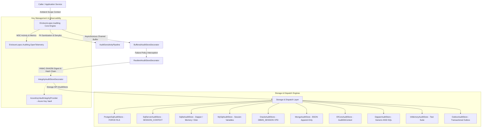
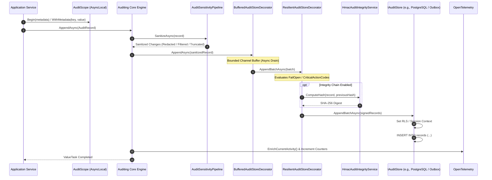

<!-- Copyright © Erickson Lopez. MIT License. -->
# System Architecture Guide: EricksonLopez.Auditing

## 1. Executive Summary & Core Mission

`EricksonLopez.Auditing` is a forensic audit trail and change-evidence framework for modern .NET (`net8.0`, `net9.0`, `net10.0`). Built with a **Native AOT-first**, **Multi-Tenant native**, **Append-Only immutable**, and **HMAC-SHA256 cryptographically verifiable** design, it satisfies stringent compliance mandates including **SOC2**, **PCI-DSS**, **GDPR**, and **HIPAA**.

The framework answers with non-repudiable certainty:
> **Who (Actor) · Performed what (Action) · On what resource (Resource) · When (OccurredAt) · From what context (Context) · With what outcome (Outcome)**



---

## 2. Core Architectural Invariants

1. **Immutability and Append-Only Storage**: The core storage interface `IAuditStore` exposes only append operations (`AppendAsync`, `AppendBatchAsync`) and queries (`QueryAsync`). No `Update` or `Delete` operations exist in the API or database migrations.
2. **Strict Multi-Tenant Isolation**: Every record requires a valid `TenantId` (or the reserved platform constant `AuditContext.SystemTenantId`). Relational storage engines enforce isolation at the database layer before query execution via session variables, RLS, or connection context.
3. **Monotonic Temporal Ordering via UUIDv7**: Identifiers are generated with `AuditId.NewId()` conforming to RFC 9562 UUIDv7. Unix millisecond timestamps in high bits ensure sequential index inserts and eliminate B-Tree page fragmentation.
4. **Zero-Leakage Security Invariant**: The `AuditSensitivityPipeline` intercepts and strips sensitive credentials, tokens, and PII before persistence according to global denylists, string length limits (`MaxStringLength`), and explicit redaction rules.
5. **Zero Dynamic Runtime Reflection**: JSON column serialization uses C# source generators (`System.Text.Json.Serialization.JsonSerializerContext`), ensuring full compatibility with Native AOT compilation and aggressive IL trimming across all providers.
6. **Crypto-Shredding Compliance (GDPR Art. 17)**: PII fields are protected using subject-specific encryption keys managed by `IAuditCryptoKeyProvider`. When key destruction (`ShredKeyAsync`) is executed, encrypted PII becomes permanently unrecoverable without altering or invalidating the historical cryptographic blockchain.

---

## 3. End-to-End Audit Pipeline Sequence



---

## 4. Cryptographic HMAC-SHA256 Integrity Chain

For compliance mandates requiring non-repudiation and cryptographic proof of tamper-evidence, each record computes a digest over canonical byte representations linked to the predecessor's hash:

$$\text{CanonicalBytes} = \text{Id} \parallel \text{OccurredAtMs} \parallel \text{TenantId} \parallel \text{ActorType} \parallel \text{ActorId} \parallel \text{ActionCode} \parallel \text{ResourceType} \parallel \text{ResourceId} \parallel \text{Outcome} \parallel \text{PreviousHash}$$

$$\text{IntegrityHash} = \text{HMAC-SHA256}(\text{Key}_{\text{tenant}}, \text{CanonicalBytes})$$

```mermaid
graph LR
    subgraph Audit Record Chain (Tenant A)
        R1["Record #1 (Genesis)<br/>PrevHash: null<br/>Hash: 8234ff..."] -->|Links to| R2["Record #2<br/>PrevHash: 8234ff...<br/>Hash: a0ee97..."]
        R2 -->|Links to| R3["Record #3<br/>PrevHash: a0ee97...<br/>Hash: 3ed424..."]
    end
```

If an attacker modifies any field of a stored record (such as altering `Outcome` from `Denied` to `Success` or changing `ResourceId`), verification via `IAuditIntegrityVerifier.VerifyChainAsync()` detects the discrepancy and pinpoints the exact record ID.

---

## 5. Multi-Tenant Database Isolation Strategies

| Database Engine | Native Security Mechanism | Session Command Executed Before Queries |
| :--- | :--- | :--- |
| **PostgreSQL** | Row-Level Security (`FORCE ROW LEVEL SECURITY`) | `SELECT set_config('audit.tenant_id', @TenantId, false);` |
| **SQL Server** | Security Policy + Session Context | `EXEC sp_set_session_context @key=N'TenantId', @value=@TenantId, @read_only=0;` |
| **MySQL / MariaDB** | Session Variables + InnoDB Indexes | `SET @audit_tenant_id = @TenantId;` |
| **Oracle Database** | `DBMS_SESSION` Virtual Private Database (VPD) | `DBMS_SESSION.SET_IDENTIFIER(@TenantId);` |
| **SQLite** | Local / Edge Database Separation | Connection-level parameterization & index filter |
| **MongoDB** | BSON Document Partitioning | Tenant-scoped collection indexes |
| **EF Core** | Global Query Filter & Model Mapping | Tenant-scoped queries on `AuditDbContext` |
| **Outbox** | Staged Message Storage | Appends to local transactional outbox |

---

## 6. Internal Project Dependency Architecture

The repository enforces strict architectural layering:

```mermaid
graph TD
    classDef abstract fill:#4a154b,stroke:#fff,stroke-width:2px,color:#fff;
    classDef core fill:#005a9c,stroke:#fff,stroke-width:2px,color:#fff;
    classDef adapter fill:#2e7d32,stroke:#fff,stroke-width:2px,color:#fff;
    classDef test fill:#e65100,stroke:#fff,stroke-width:2px,color:#fff;

    Abs["EricksonLopez.Auditing.Abstractions"]:::abstract
    Core["EricksonLopez.Auditing (Core)"]:::core
    Anlz["EricksonLopez.Auditing.Analyzers"]:::core
    AKV["EricksonLopez.Auditing.AzureKeyVault"]:::adapter
    OUT["EricksonLopez.Auditing.Outbox"]:::adapter
    OTel["EricksonLopez.Auditing.OpenTelemetry"]:::adapter
    Testing["EricksonLopez.Auditing.Testing"]:::test
    
    PG["EricksonLopez.Auditing.PostgreSql"]:::adapter
    MS["EricksonLopez.Auditing.SqlServer"]:::adapter
    My["EricksonLopez.Auditing.MySql"]:::adapter
    Ora["EricksonLopez.Auditing.Oracle"]:::adapter
    Sq["EricksonLopez.Auditing.Sqlite"]:::adapter
    Dap["EricksonLopez.Auditing.Dapper"]:::adapter
    EF["EricksonLopez.Auditing.EntityFrameworkCore"]:::adapter
    Mon["EricksonLopez.Auditing.MongoDb"]:::adapter

    Core --> Abs
    Core -.->|Analyzers| Anlz
    AKV --> Abs
    OUT --> Abs
    OTel --> Abs
    Testing --> Abs
    Testing --> Core
    
    PG --> Dap
    MS --> Dap
    My --> Dap
    Ora --> Dap
    Sq --> Dap
    Dap --> Abs
    EF --> Abs
    Mon --> Abs
```



* **Layer 1: Abstractions (`EricksonLopez.Auditing.Abstractions`):** Zero external dependencies. Owns domain contracts (`AuditRecord`, `AuditContext`), storage SPI (`IAuditStore`), provider interfaces (`IAuditCryptoKeyProvider`, `IAuditHashAlgorithm`), and pure HMAC computation.
* **Layer 2: Core Engine & Compile-Time Analyzers:**
  - `EricksonLopez.Auditing`: Owns `AuditScope` ambient orchestration, RFC 9562 UUIDv7 generator (`AuditId`), sensitivity pipeline, decorators (`BufferedAuditStoreDecorator`, `ResilientAuditStoreDecorator`, `IntegrityAuditStoreDecorator`), and fluent DI builder.
  - `EricksonLopez.Auditing.Analyzers`: Roslyn diagnostic analyzers and code fixes enforcing immutability and compliance at compile time.
* **Layer 3: Enterprise Integrations (`AzureKeyVault`, `Outbox`):**
  - `AzureKeyVault`: Cloud KMS secret retrieval for cryptographic keys and automated rotation.
  - `Outbox`: Transactional outbox storage decorator and message contracts.
* **Layer 4: Storage Adapters (`PostgreSql`, `SqlServer`, `MySql`, `Oracle`, `Sqlite`, `Dapper`, `MongoDb`, `EntityFrameworkCore`):** Standalone database drivers implementing `IAuditStore` with native session contexts, keyset pagination, and Dapper/EF/BSON persistence.
* **Layer 5: Observability (`EricksonLopez.Auditing.OpenTelemetry`):** W3C TraceContext enrichment, semantic activities, and counters.
* **Layer 6: Testing Infrastructure (`EricksonLopez.Auditing.Testing`):** `InMemoryAuditStore`, fluent `AuditRecordBuilder`, and mock cryptographic key providers for unit tests.
