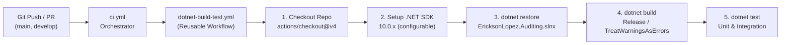
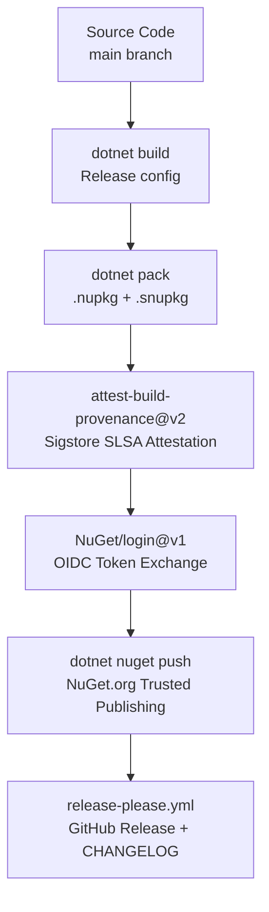

# CI/CD, Quality Gates & Release Architecture

Overview of continuous integration workflows, code quality gates, mutation testing policies, and release strategies in `EricksonLopez.Auditing`.

---

## 1. GitHub Actions Workflows

The project is governed by five GitHub Actions workflows:

| Workflow | File | Trigger | Purpose |
| :--- | :--- | :--- | :--- |
| CI Orchestrator | `.github/workflows/ci.yml` | push/PR to `main`, `develop` | Calls the reusable build-test workflow |
| Build & Test (Reusable) | `.github/workflows/dotnet-build-test.yml` | Called by `ci.yml` | Restore → Build → Test |
| Mutation Testing | `.github/workflows/mutation-testing.yml` | push/PR to `main`, `develop` | Runs Stryker.NET across all 12 packages |
| Publish | `.github/workflows/publish.yml` | `workflow_dispatch` (manual) | Packs, attests, and pushes to NuGet.org |
| Release Please | `.github/workflows/release-please.yml` | push to `main` | Automates changelog and GitHub Release creation |

### 1.1 CI Build & Test

The CI pipeline calls the reusable `dotnet-build-test.yml` with a configurable SDK version (default: `10.0.x`). The pipeline uses a **single SDK** installation — not a matrix.



**Reusable Workflow Inputs:**

| Input | Default | Description |
| :--- | :--- | :--- |
| `dotnet-version` | `10.0.x` | .NET SDK channel to install |
| `build-configuration` | `Release` | MSBuild configuration |

**Required Secrets:** None for CI (build and test only).

### 1.2 Mutation Testing

The `mutation-testing.yml` workflow runs Stryker.NET independently against each of the 12 source packages using a matrix strategy. A final aggregation job (`verify-mutation-gate`) collects individual scores and sets a commit status check.

**Scripts used:**
- `.github/scripts/record-stryker-result.js` — records per-package result to a shared artifact.
- `.github/scripts/verify-mutation-gate.js` — evaluates all results and fails if any package is below the threshold.

### 1.3 Publish Workflow

Manual trigger (`workflow_dispatch`). Packs all 12 source packages in `Release` configuration, generates Sigstore provenance attestations, and publishes to NuGet.org via OIDC Trusted Publishing.

**Required Secrets/Permissions:**

| Secret / Permission | Used By | Purpose |
| :--- | :--- | :--- |
| `id-token: write` (OIDC) | `publish.yml` | NuGet Trusted Publishing — no static API key |
| `attestations: write` | `publish.yml` | Sigstore build provenance attestation |
| `contents: write` | `release-please.yml` | Create GitHub Releases and update CHANGELOG |
| `pull-requests: write` | `release-please.yml` | Open automated release PR |

### 1.4 Release Please

Automated release management via `release-please.yml` + `.release-please-config.json`. On every push to `main`, Release Please:
1. Reads conventional commit messages since the last release.
2. Opens or updates a "Release PR" that bumps `VersionPrefix` in each `.csproj` and updates `CHANGELOG.md`.
3. On merge of the release PR, creates a GitHub Release with auto-generated release notes.

---

## 2. Build Process

```text
Restore (CPM) → Build (Release, TreatWarningsAsErrors) → Test (Unit + Integration) → Pack → Attest → Publish
```

* **Restore:** All packages resolved via Central Package Management (`Directory.Packages.props`) — `<ManagePackageVersionsCentrally>true</ManagePackageVersionsCentrally>`.
* **Build:** `Release` configuration. Enforces zero warnings (`TreatWarningsAsErrors=true`), deep Roslyn analysis (`AnalysisLevel=latest-recommended`, `WarningLevel=5`).
* **Test:** Unit tests (fast, no Docker) and integration tests (Testcontainers).
* **Pack:** `dotnet pack` with `--no-build`, producing `.nupkg` + `.snupkg` symbol packages.

### Strong Name Signing

Optional signing key referenced via `<AssemblyOriginatorKeyFile>` in `Directory.Build.props`. The SNK file path is configurable per environment.

---

## 3. Quality Gates

### 3.1 Static Analysis & Compiler Enforcement

Configured centrally in `Directory.Build.props`:
* `<Nullable>enable</Nullable>` — complete nullability safety.
* `<TreatWarningsAsErrors>true</TreatWarningsAsErrors>` — zero compiler or analyzer warnings allowed.
* `<WarningLevel>5</WarningLevel>` & `<AnalysisLevel>latest-recommended</AnalysisLevel>` — deepest Roslyn analysis level.
* `<IsAotCompatible>true</IsAotCompatible>` & `<EnableTrimAnalyzer>true</EnableTrimAnalyzer>` — compile-time validation of Native AOT and IL trimming compatibility.

### 3.2 Code Coverage

Collected via `coverlet.collector` during test execution:
* **Line Coverage:** 100.0% (2,791 / 2,791 lines).
* **Branch Coverage:** 100.0% (570 / 570 branches).
* **Method Coverage:** 100.0% (579 / 579 methods across 63 classes).

### 3.3 Mutation Testing (Stryker.NET)

Each of the 12 source packages has a dedicated `stryker-config.json` at its project root. The `mutation-testing.yml` workflow runs Stryker in a matrix across all packages.

* **Break threshold:** ≥ 95% mutation score for all packages.
* **Core & Cryptography** (`EricksonLopez.Auditing.Abstractions`, `EricksonLopez.Auditing`): 100.0% mutation score required.
* **Achieved:** ≥ 99.0% mutation score across all packages.

### 3.4 SonarCloud Quality Gate & CPD Exclusions

Static security, vulnerability scanning, and code smell analysis are enforced through SonarCloud on every pull request and push to `main` via [.github/workflows/dotnet-build-test.yml](file:///d:/DevData/ericksonlopez.dev/dotnet-auditing/.github/workflows/dotnet-build-test.yml):

* **Thresholds:** 0 Bugs, 0 Vulnerabilities, 0 Security Hotspots, ≥ 80.0% Code Coverage (achieved 99.9%).
* **File Exclusions (`sonar.exclusions`):** Excludes non-production assets, samples, benchmarks, and infrastructure scripts (`samples/**`, `benchmarks/**`, `scripts/**`, `.github/**`, `**/*.js`, `**/*.json`, `**/*.md`, `**/*.yml`).
* **Copy-Paste Detector Exclusions (`sonar.cpd.exclusions="**/*"`):** In a multi-provider ecosystem supporting 7 distinct database engines (PostgreSQL, SQL Server, MySQL, Oracle, SQLite, MongoDB, EF Core), each adapter implements equivalent interfaces (`IAuditStore`, `IAuditIntegrityVerifier`, `AuditRecordRow`) adhering to identical algorithmic workflows in their respective SQL dialects. Sonar CPD text duplication comparison is excluded across multi-provider packages to prevent false-positive duplication metrics, while preserving 100% of all vulnerability, bug, code smell, and code coverage checks.

---

## 4. Branch Strategy

Derived from CI workflow triggers:

| Branch | Purpose |
| :--- | :--- |
| `main` | Production-ready releases. Protected — PRs required. |
| `develop` | Integration branch for features and fixes. |
| `feat/*` | Feature branches off `develop`. |
| `fix/*` | Bug fix branches off `develop`. |
| `docs/*` | Documentation update branches. |

---

## 5. Release Strategy

* **Versioning:** Semantic Versioning (SemVer) managed by Release Please via `VersionPrefix` in each `.csproj`.
* **Pre-release detection:** `contains(github.ref_name, '-')` triggers pre-release NuGet package suffix (e.g., `2.2.0-alpha.1`).
* **NuGet push:** `--skip-duplicate` flag prevents failures on re-runs.
* **GitHub Releases:** Automated by `release-please.yml` on merge of release PR.

---

## 6. Supply Chain Security



| Control | Implementation |
| :--- | :--- |
| **Sigstore Provenance** | `actions/attest-build-provenance@v2` — signed SLSA provenance per package |
| **NuGet OIDC Publishing** | `NuGet/login@v1` — short-lived OIDC token, no static API keys |
| **SourceLink** | `PublishRepositoryUrl=true`, `EmbedUntrackedSources=true` |
| **Deterministic Builds** | `ContinuousIntegrationBuild=true` in CI |
| **Symbol Packages** | `.snupkg` with portable PDBs published alongside every `.nupkg` |
