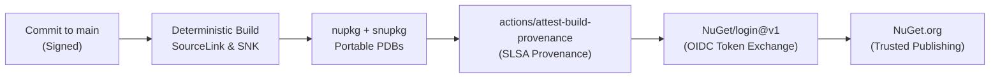

<!-- Copyright © Erickson Lopez. MIT License. -->
# CI/CD, Quality Gates & Release Architecture

Comprehensive specification of continuous integration workflows, automated quality gates, performance regression checks, mutation testing matrices, and release pipelines in `EricksonLopez.Auditing`.

---

## 1. GitHub Actions Workflows

The repository is governed by 10 dedicated GitHub Actions workflows ensuring strict adherence to build, test, security, performance, and compliance gates:

| Workflow | File | Trigger | Purpose |
| :--- | :--- | :--- | :--- |
| **CI Orchestrator** | `.github/workflows/ci.yml` | push / PR to `main`, `develop` | Primary continuous integration orchestrator; triggers build, unit tests, and AOT smoke tests |
| **Build & Test (Reusable)** | `.github/workflows/dotnet-build-test.yml` | `workflow_call` from `ci.yml` | Executes compliance checks, formatting verification, Release build, unit tests, SonarCloud, and Codecov |
| **Native AOT Smoke Test** | `.github/workflows/aot-smoke-test.yml` | `workflow_call` from `ci.yml` | Validates Native AOT compilation and publishing for linux-x64 with zero trimming warnings |
| **Repository Compliance** | `.github/workflows/compliance.yml` | push / PR to `main`, `develop` | Validates MIT license headers, one-type-per-file, kebab-case naming, and Stryker matrix synchronization |
| **Mutation Testing (Stryker)** | `.github/workflows/mutation-testing.yml` | Weekly (Mon 04:00 UTC), dispatch, call | Runs Stryker.NET mutation testing matrix across all 15 source packages with a break threshold of 95% |
| **Benchmark Baseline Capture** | `.github/workflows/benchmarks.yml` | `workflow_dispatch` (manual) | Runs BenchmarkDotNet across .NET 8, 9, 10 and commits markdown performance reports to `benchmarks/results/` |
| **Weekly Benchmarks** | `.github/workflows/weekly-benchmarks.yml` | Weekly (Sun 02:00 UTC), dispatch | Executes deep statistical BenchmarkDotNet review using the Default Job configuration |
| **Benchmark Regression Gate** | `.github/workflows/benchmark-regression-gate.yml` | PR to `main`, `develop` modifying `src/**` | Validates zero heap allocation on hot paths and asserts latency regression does not exceed 5% vs baseline |
| **NuGet Publish** | `.github/workflows/publish.yml` | Tag push `v*.*.*`, dispatch, call | Enforces benchmark gate, runs tests, packs 12 client packages, generates Sigstore provenance, and pushes via OIDC |
| **Release Please** | `.github/workflows/release-please.yml` | push to `main` | Automates SemVer release PRs and GitHub Releases using Conventional Commits |

---

## 2. End-to-End Pipeline Lifecycle

```mermaid
graph TD
    subgraph PullRequest["Pull Request & Merge Validation"]
        PR["PR to main / develop"] --> CI["ci.yml"]
        PR --> COMP["compliance.yml"]
        PR --> BGATE["benchmark-regression-gate.yml"]
        
        CI --> BT["dotnet-build-test.yml"]
        CI --> AOT["aot-smoke-test.yml"]
        
        BT --> CHK["1. verify-solution-compliance.js"]
        BT --> FMT["2. dotnet format --verify-no-changes"]
        BT --> BUILD["3. dotnet build -c Release"]
        BT --> TEST["4. dotnet test (Unit & InMemory)"]
        BT --> SONAR["5. SonarCloud Analysis"]
        BT --> CODECOV["6. Codecov Upload"]
        
        COMP --> COMP_SCRIPT["scripts/verify-compliance.ps1"]
        BGATE --> BENCH_RUN["Run Benchmarks (PR Head)"]
        BENCH_RUN --> BENCH_ASSERT["scripts/verify-benchmark-gate.ps1<br/>(0B Alloc, <=5% Latency Degradation)"]
    end

    subgraph ScheduledGates["Scheduled & Asynchronous Quality Gates"]
        SCHED_MUT["Weekly Schedule (Mon 04:00)"] --> MUT["mutation-testing.yml"]
        MUT --> STRYKER_MATRIX["15-Package Stryker Matrix<br/>(Core, Abstractions, Adapters, Outbox)"]
        STRYKER_MATRIX --> MUT_GATE["scripts/verify-mutation-gate.js<br/>(Break: 95%, Core: 100%)"]
        
        SCHED_BENCH["Weekly Schedule (Sun 02:00)"] --> WBENCH["weekly-benchmarks.yml"]
        WBENCH --> BASELINE["Update Performance Baseline"]
    end

    subgraph ReleaseAndPublish["Release & Supply Chain Publishing"]
        PUSH_MAIN["Merge to main"] --> RP["release-please.yml"]
        RP -->|Release PR Merged| REL_CREATED["GitHub Release Created (vX.Y.Z)"]
        REL_CREATED --> PUB["publish.yml"]
        PUB --> PUB_BGATE["Benchmark Gate Validation"]
        PUB_BGATE --> PUB_MUT["Mutation Gate Validation"]
        PUB_MUT --> PACK["dotnet pack (Release)"]
        PACK --> SIGSTORE["actions/attest-build-provenance@v2<br/>(Sigstore SLSA Attestation)"]
        SIGSTORE --> NUGET_OIDC["NuGet/login@v1 (OIDC)"]
        NUGET_OIDC --> PUSH_NUGET["dotnet nuget push to NuGet.org"]
    end
```

---

## 3. Workflow Specifications

### 3.1 Reusable Build & Test (`dotnet-build-test.yml`)
* **Trigger:** Called by `ci.yml` on every push and pull request targeting `main` and `develop`.
* **Inputs:**
  * `dotnet-version` (default: `10.0.x`): Primary SDK version for build and test execution.
  * `test-filter` (default: `"Category!=Integration"`): Filters out long-running Testcontainers integration tests during rapid CI runs.
  * `test-project` (optional): Specifies a single test project when needed.
  * `upload-coverage` (default: `true`): Toggles Codecov report upload.
  * `artifact-name` (default: `"test-results"`): Result artifact identifier.
* **Secrets:**
  * `CODECOV_TOKEN`: Codecov upload authentication.
  * `SONAR_TOKEN`: SonarCloud project analysis token.
* **Steps:**
  1. Verifies solution structure via `node scripts/verify-solution-compliance.js`.
  2. Verifies code formatting with `dotnet format --verify-no-changes`.
  3. Prepares SonarScanner with strict coverage and file exclusions.
  4. Builds solution in `Release` configuration with `TreatWarningsAsErrors=true`.
  5. Executes tests with OpenCover and Cobertura coverage collectors.
  6. Concludes SonarScanner analysis and uploads coverage reports.

### 3.2 Native AOT Smoke Test (`aot-smoke-test.yml`)
* **Trigger:** Called by `ci.yml`.
* **Action:** Publishes `tests/EricksonLopez.Auditing.AotSmokeTest` targeting `linux-x64` with `--self-contained` in `Release` configuration.
* **Invariant:** Zero trimming warnings and clean binary output, guaranteeing Native AOT compatibility for consumers.

### 3.3 Repository Compliance Gate (`compliance.yml`)
* **Trigger:** Runs on push and PR to `main` and `develop`.
* **Scripts Executed:**
  * `node scripts/verify-solution-compliance.js`
  * `powershell scripts/verify-compliance.ps1`
* **Rules Enforced:**
  1. Kebab-case documentation naming convention in `docs/` and root exemptions.
  2. Canonical MIT license headers across all `.cs`, `.csproj`, `.props`, `.targets`, `.slnx`, `.yml`, and `.ps1` files.
  3. "One Type Per File" rule across all top-level types in `src/`.
  4. Zero `[Obsolete]` attribute usages in codebase.
  5. Official security and support email normalization (`ericksonlopezf@gmail.com`).
  6. Central `Directory.Build.props` invariants.
  7. Zero prohibited `<NoWarn>` suppressions (CS0618, CS0619, CS1591, CA1707, SYSLIB0057).
  8. Internal Markdown link resolution and case-sensitivity validation.
  9. Stryker matrix synchronization across all packages.

### 3.4 Mutation Testing (`mutation-testing.yml`)
* **Trigger:** Scheduled weekly on Mondays at 04:00 UTC, manual `workflow_dispatch`, or `workflow_call`.
* **Concurrency:** Matrix execution across 15 packages:
  1. `Core` (`stryker-config.json`)
  2. `Abstractions` (`stryker-abstractions-config.json`)
  3. `Dapper` (`stryker-dapper-config.json`)
  4. `PostgreSql` (`stryker-postgresql-config.json`)
  5. `SqlServer` (`stryker-sqlserver-config.json`)
  6. `Sqlite` (`stryker-sqlite-config.json`)
  7. `MySql` (`stryker-mysql-config.json`)
  8. `Oracle` (`stryker-oracle-config.json`)
  9. `Testing` (`stryker-testing-config.json`)
  10. `OpenTelemetry` (`stryker-opentelemetry-config.json`)
  11. `EntityFrameworkCore` (`stryker-efcore-config.json`)
  12. `MongoDb` (`stryker-mongodb-config.json`)
  13. `Analyzers` (`stryker-analyzers-config.json`)
  14. `AzureKeyVault` (`stryker-azurekeyvault-config.json`)
  15. `Outbox` (`stryker-outbox-config.json`)
* **Threshold Policy:**
  * `high: 100%`, `low: 98%`, `break: 95%`.
  * Core and Abstractions require 100.0% mutation score.
* **Evaluation Scripts:**
  * `scripts/record-stryker-result.js`: Persists per-package run metrics.
  * `scripts/verify-mutation-gate.js`: Aggregates scores and enforces threshold barriers.

### 3.5 Benchmark Regression Gate (`benchmark-regression-gate.yml`)
* **Trigger:** Pull requests modifying `src/**` or `benchmarks/**`.
* **Criteria Evaluated via `scripts/verify-benchmark-gate.ps1`:**
  1. **Heap Allocation Invariant:** Hot path combinators (UUIDv7 generation, HMAC calculation, sensitivity filtering) must allocate **0 B** on heap.
  2. **Latency Degradation Threshold:** Mean execution latency must not degrade by more than **5%** against the baseline recorded in `benchmarks/results/`.

### 3.6 Publish Pipeline (`publish.yml`)
* **Trigger:** Pushing a `v*.*.*` tag or automated dispatch from Release Please.
* **Execution Gates:**
  1. Evaluates multi-TFM benchmark suite (.NET 8.0, 9.0, 10.0).
  2. Validates Stryker mutation quality gate.
  3. Runs test suite with code coverage verification.
  4. Packs 12 distributable NuGet packages in `Release` configuration.
  5. Attests packages with Sigstore build provenance (`actions/attest-build-provenance@v2`).
  6. Authenticates with NuGet.org via short-lived OIDC exchange (`NuGet/login@v1`).
  7. Pushes `.nupkg` and `.snupkg` artifacts with `--skip-duplicate`.
  8. Generates GitHub Release with package inventory and changelog link.

---

## 4. Build Process & Central Configuration

The build process is centrally defined and enforced across the entire solution:

* **Central Package Management (CPM):** Managed centrally in `Directory.Packages.props` (`<ManagePackageVersionsCentrally>true</ManagePackageVersionsCentrally>`). Individual `.csproj` files declare `<PackageReference Include="..." />` without explicit versions.
* **Compiler Quality Standards (`Directory.Build.props`):**
  * `<Nullable>enable</Nullable>`: Complete nullability flow analysis.
  * `<TreatWarningsAsErrors>true</TreatWarningsAsErrors>`: Zero compiler warnings permitted.
  * `<WarningLevel>5</WarningLevel>` & `<AnalysisLevel>latest-recommended</AnalysisLevel>`: Deepest Roslyn diagnostics.
  * `<EnableTrimAnalyzer>true</EnableTrimAnalyzer>`: Static trimming verification for trimming safety.
  * `<GenerateDocumentationFile>true</GenerateDocumentationFile>`: Enforces full XML doc generation across public surfaces.
* **Deterministic Builds & SourceLink:**
  * `Microsoft.SourceLink.GitHub` integrated centrally.
  * `PublishRepositoryUrl=true`, `EmbedUntrackedSources=true`, and `SymbolPackageFormat=snupkg`.
* **Strong Name Signing:**
  * Assemblies are strongly signed using `EricksonLopez.Auditing.snk` when present in root or CI environment (`<AssemblyOriginatorKeyFile>`).

---

## 5. Branch Strategy

Derived from CI triggers and release automation:

| Branch | Protection | Purpose |
| :--- | :---: | :--- |
| `main` | Protected | Production-ready releases. Direct pushes forbidden. All changes land via squashed or rebased Pull Requests. |
| `develop` | Protected | Active integration branch. Serves as PR target for standard feature and fix branches. |
| `feat/*` | Unprotected | Feature development branches branching from `develop`. |
| `fix/*` | Unprotected | Bug fix branches branching from `develop`. |
| `docs/*` | Unprotected | Documentation improvement branches branching from `develop`. |
| `refactor/*` | Unprotected | Non-functional refactoring branches. |

---

## 6. Supply Chain Security

`EricksonLopez.Auditing` implements defense-in-depth supply chain security controls:

| Security Layer | Mechanism & Implementation |
| :--- | :--- |
| **Identity & Attestation** | Signed SLSA provenance generated via `actions/attest-build-provenance@v2` allowing consumers to verify package origin using `gh attestation verify`. |
| **Credential-Free Publishing** | NuGet.org Trusted Publishing via OIDC token exchange (`NuGet/login@v1`). No static `NUGET_API_KEY` exists in repository secrets. |
| **Assembly Authenticity** | Cryptographic strong-name signing via 1024-bit SNK key prevents assembly substitution and spoofing. |
| **Source Traceability** | SourceLink embeds Git commit SHA and source repository URLs directly within symbol packages (`.snupkg`). |
| **Dependency Scanning** | Dependabot scans both NuGet dependencies and GitHub Actions monthly/weekly, opening grouping PRs targeting `develop`. |
