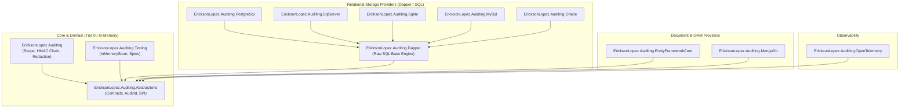

# Functional Architecture & SPI Map — EricksonLopez.Auditing

## 1. Architectural Layers & Boundaries

`EricksonLopez.Auditing` follows strict Clean Architecture and Service Provider Interface (SPI) separation across 12 segregated packages.

---

## 2. Service Provider Interface (SPI) Matrix

| SPI Interface | Primary Responsibility | Registered Implementations |
|---|---|---|
| `IAuditStore` | Append-only persistence of validated `AuditRecord` entries | `InMemoryAuditStore`, `PostgreSqlAuditStore`, `SqlServerAuditStore`, `SqliteAuditStore`, `MySqlAuditStore`, `OracleAuditStore`, `MongoAuditStore` |
| `IAuditIntegrityValidator` | Cryptographic verification of HMAC-SHA256 hash chains | `HmacIntegrityValidator` |
| `IAuditSensitivityPipeline` | Payload inspection and PII redaction/masking | `DefaultAuditSensitivityPipeline` |
| `IAuditScopeFactory` | Ambient audit context lifecycle management | `AuditScopeFactory` |

---

## 3. Cryptographic Hash Chaining Invariant

Every record written through `IAuditStore` satisfies the hash-chain invariant:

$$\text{CurrentHash} = \text{HMAC-SHA256}_{K}(\text{Id} \parallel \text{TenantId} \parallel \text{Timestamp} \parallel \text{ActorId} \parallel \text{Action} \parallel \text{PayloadHash} \parallel \text{PreviousRecordHash})$$

This mathematical link ensures that inserting, modifying, or truncating any historical record immediately breaks the signature of all subsequent records in the chain.
