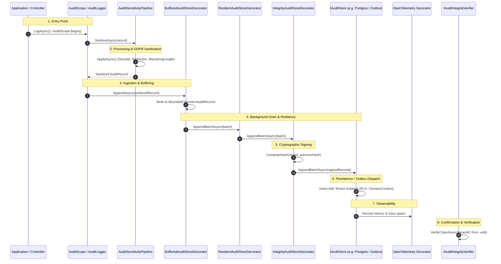

<!-- Copyright © Erickson Lopez. MIT License. -->
# Functional Architecture & SPI Map — EricksonLopez.Auditing

## 1. Architectural Layers & Boundaries

`EricksonLopez.Auditing` enforces strict Clean Architecture and Service Provider Interface (SPI) segregation across 15 core and infrastructure libraries, with zero circular dependencies.

```mermaid
graph TD
    subgraph CoreDomain["Core & Domain (Tier 0 / AOT Compliant)"]
        ABS["EricksonLopez.Auditing.Abstractions<br/>(Contracts, AuditId, SPI, Enums)"]
        CORE["EricksonLopez.Auditing<br/>(Scope, Pipeline, Decorators, Logger)"]
        ANALYZERS["EricksonLopez.Auditing.Analyzers<br/>(Roslyn Rules & CodeFixes)"]
    end

    subgraph ResiliencyAndBatching["Pipeline Decorators & Buffers"]
        BUF["BufferedAuditStoreDecorator<br/>(System.Threading.Channels)"]
        RES["ResilientAuditStoreDecorator<br/>(FailOpen / Critical Codes)"]
        INT["IntegrityAuditStoreDecorator<br/>(Automatic HMAC Chaining)"]
    end

    subgraph CloudAndOutbox["Enterprise Integrations"]
        AKV["EricksonLopez.Auditing.AzureKeyVault<br/>(AzureKeyVaultIntegrityProvider)"]
        OUT["EricksonLopez.Auditing.Outbox<br/>(OutboxAuditStore / IOutboxMessageService)"]
    end

    subgraph Relational["Relational Storage Providers (Dapper / SQL)"]
        DAPPER["EricksonLopez.Auditing.Dapper<br/>(Generic ANSI SQL Base Engine)"]
        PG["EricksonLopez.Auditing.PostgreSql<br/>(FORCE RLS + Keyset)"]
        MSSQL["EricksonLopez.Auditing.SqlServer<br/>(SESSION_CONTEXT + Security Policy)"]
        SQLITE["EricksonLopez.Auditing.Sqlite<br/>(Local & In-Memory Engine)"]
        MYSQL["EricksonLopez.Auditing.MySql<br/>(Session Variables + InnoDB)"]
        ORACLE["EricksonLopez.Auditing.Oracle<br/>(DBMS_SESSION VPD Context)"]
    end

    subgraph DocumentAndOrm["Document & ORM Providers"]
        EF["EricksonLopez.Auditing.EntityFrameworkCore<br/>(AuditDbContext + ModelBuilder)"]
        MONGO["EricksonLopez.Auditing.MongoDb<br/>(BSON Append-Only Document Store)"]
    end

    subgraph Observability["Observability"]
        OTEL["EricksonLopez.Auditing.OpenTelemetry<br/>(ActivitySource, Metrics, Decorators)"]
    end

    subgraph Testing["Test Infrastructure"]
        TST["EricksonLopez.Auditing.Testing<br/>(InMemoryAuditStore, Spies)"]
    end

    CORE --> ABS
    CORE -.->|Analyzers| ANALYZERS
    BUF --> ABS
    RES --> ABS
    INT --> ABS
    AKV --> ABS
    OUT --> ABS
    DAPPER --> ABS
    PG --> DAPPER
    MSSQL --> DAPPER
    SQLITE --> DAPPER
    MYSQL --> DAPPER
    ORACLE --> DAPPER
    EF --> ABS
    MONGO --> ABS
    OTEL --> ABS
    TST --> ABS
    TST --> CORE
```

---

## 2. End-to-End System Flow: From Ingestion to Verification

### Explanation of Layer Transitions:

1. **Application Entry Point**: 
   - Operations begin via `AuditScope.Begin(...)` (ambient context via `AsyncLocal<T>`) or `IAuditLogger<T>.LogAsync(...)`.
   - `AuditId.NewId()` generates a monotonic RFC 9562 UUIDv7 identifier embedding a millisecond Unix timestamp.

2. **Processing Layer (Sanitization & Privacy)**:
   - `IAuditSensitivityPipeline.SanitizeAsync` processes the record changes.
   - Values matching `AuditConfiguration.GlobalFieldDenylist` are excluded.
   - Values marked `AuditChange.Redacted()` have values suppressed.
   - Values exceeding `AuditConfiguration.MaxStringLength` are safely truncated to prevent Large Object Heap (LOH) exhaustion.
   - Optional GDPR Article 17 Crypto-Shredding via `IAuditCryptoKeyProvider`.

3. **Buffering & Throughput Layer**:
   - `BufferedAuditStoreDecorator` pushes records into a bounded `System.Threading.Channels.Channel<AuditRecord>`.
   - A single-reader background task accumulates batches up to `BatchSize` or until `FlushInterval` elapses.

4. **Resilience & Fault-Tolerance Layer**:
   - `ResilientAuditStoreDecorator` intercepts store exceptions according to `AuditConfiguration.DefaultFailureBehavior`.
   - If `FailOpen`, non-critical exceptions are logged as warnings and swallowed.
   - If action is in `CriticalActionCodes` (e.g. `ProcessPayroll`, `GrantPermission`), exceptions always propagate to halt execution.

5. **Cryptographic Integrity Layer**:
   - `IntegrityAuditStoreDecorator` retrieves the tenant's latest `IntegrityHash` and computes the new HMAC signature linked to the previous block.
   - Uses `IAuditHashAlgorithm` (`HmacSha256AuditHashAlgorithm`) and keys resolved from `IAuditIntegrityProvider` (or `AzureKeyVaultIntegrityProvider`).

6. **Persistence / Dispatch Layer**:
   - Dedicated engine stores (`PostgreSqlAuditStore`, `SqlServerAuditStore`, `SqliteAuditStore`, `MySqlAuditStore`, `OracleAuditStore`, `MongoAuditStore`, `DapperAuditStore`, `EfCoreAuditStore`) execute multi-tenant parameterization.
   - Alternatively, `OutboxAuditStore` stages the serialized record into the transactional outbox table via `IOutboxMessageService`.

7. **Observability Layer**:
   - `OpenTelemetryAuditStoreDecorator` and `OpenTelemetryAuditIntegrityVerifierDecorator` capture execution durations, increment counters (`audit.records_appended`, `audit.queries_executed`), and record W3C trace tags.

8. **Confirmation & Tamper Verification**:
   - Scheduled maintenance jobs call `IAuditIntegrityVerifier.VerifyChainAsync`.
   - Recomputes the entire chain sequentially; any altered, deleted, or inserted records fail mathematical validation immediately.

9. **Cleanup & Key Destruction**:
   - In-memory channels drain cleanly on shutdown via `IAsyncDisposable`.
   - GDPR erasure requests execute `IAuditCryptoKeyProvider.ShredKeyAsync`, rendering encrypted fields permanently unrecoverable.

---

## 3. Service Provider Interface (SPI) Matrix

| SPI Interface | Primary Responsibility | Registered Implementations |
|---|---|---|
| `IAuditStore` | Append-only persistence of validated `AuditRecord` entries | `PostgreSqlAuditStore`, `SqlServerAuditStore`, `SqliteAuditStore`, `MySqlAuditStore`, `OracleAuditStore`, `MongoAuditStore`, `DapperAuditStore`, `EfCoreAuditStore`, `InMemoryAuditStore`, `OutboxAuditStore`, `BufferedAuditStoreDecorator`, `ResilientAuditStoreDecorator`, `IntegrityAuditStoreDecorator`, `OpenTelemetryAuditStoreDecorator` |
| `IAuditIntegrityVerifier` | Cryptographic verification of historical HMAC hash chains | `PostgreSqlAuditIntegrityVerifier`, `SqlServerAuditIntegrityVerifier`, `SqliteAuditIntegrityVerifier`, `MySqlAuditIntegrityVerifier`, `OracleAuditIntegrityVerifier`, `OpenTelemetryAuditIntegrityVerifierDecorator` |
| `IAuditIntegrityProvider` | Resolves tenant cryptographic keys for HMAC signing | `AzureKeyVaultIntegrityProvider`, `TestAuditIntegrityProvider` |
| `IAuditCryptoKeyProvider` | Manages encryption keys for GDPR Article 17 Crypto-Shredding | Custom enterprise implementations |
| `IAuditHashAlgorithm` | Low-level cryptographic digest algorithm provider | `HmacSha256AuditHashAlgorithm` |
| `IAuditActorProvider` | Resolves ambient actor executing current operation | `SystemAuditActorProvider`, Custom Claims/HttpContext providers |
| `IAuditContextProvider` | Resolves ambient tenant, correlation, and source | Custom ambient context providers |
| `IAuditSensitivityPipeline` | Sanitizes changes, applies denylists and truncation | `AuditSensitivityPipeline` |
| `IAuditTimeProvider` | Provides deterministic or ambient UTC timestamps | `AmbientAuditTimeProvider` |
| `IAuditLogger` / `IAuditLogger<T>` | Simplified facade for logging audit events | `AuditLogger<TCategoryName>` |
| `IOutboxMessageService` | Stages serialized audit messages in transactional outbox | Custom database outbox providers |
| `IAuditBuilder` | Fluent DI registration builder | `AuditBuilder` |

---

## 4. Cryptographic Hash Chaining Invariant

Every record written through the cryptographic integrity pipeline satisfies the hash-chain invariant:

$$\text{CanonicalBytes} = \text{Id} \parallel \text{OccurredAtMs} \parallel \text{TenantId} \parallel \text{ActorType} \parallel \text{ActorId} \parallel \text{ActionCode} \parallel \text{ResourceType} \parallel \text{ResourceId} \parallel \text{Outcome} \parallel \text{PreviousHash}$$

$$\text{IntegrityHash} = \text{HMAC-SHA256}_{K_{\text{tenant}}}(\text{CanonicalBytes})$$

This mathematical link guarantees that modifying, inserting, deleting, or reordering any record breaks the signature of all subsequent records in the chain.
